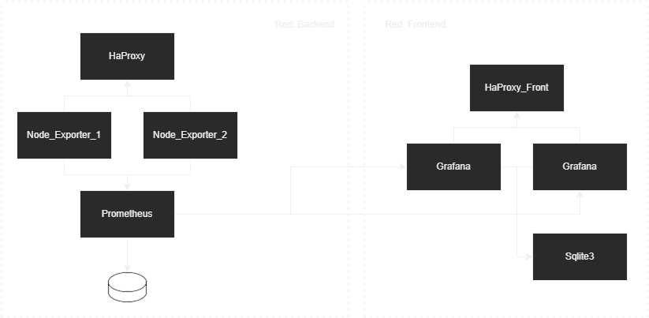

# DOCUMENTACION PRACTICA 1

Jorge Prieto Gómez --> [GitHub](https://github.com/soyjorgeprg)

## Descripción de la práctica y problema a resolver

Esta práctica consiste en desplegar de un sistema de monitorización basado en Prometheus que permita capturar las métricas, insertarlas en su base de datos y publicarlas para poder visualizarlas a través de Grafana.

En este trabajo se hará uso de varios sistemas de despliegue diferentes:

* Scripting: [documentacion](script/README.md)
* Docker Compose: [documentacion](script/README.md)
* Minikube: [documentacion](script/README.md)

## Servicios desplegados y su configuración

Cada unas de las maneras de realizar el despliegue están explicadas en cada uno de los README.md (enlaces en el apartado anterior). Aquí nos centraremos en explicar como hemos obtenido cada uno de los scripts de manera especifica.

### Scripting

Primero diseñé la infraestructura a realizar, compuesta por 5 instancias, 1 Haproxy, 2 NodeExporter, 1 Prometheus y 1 Grafana. El HaProxy serviría como balanceador entre los dos NodeExporter, que estarían conectados al nodo de Prometheus que serviría las métricas a Grafana para una mejor visualización.

Por tanto para comenzar lo primero que necesitaremos será generar tanto las redes correspondientes a esta infraestructura. En este caso solo será necesaria una única red puesto que al ser pocas instancias no vi el sentido de generar una segunda. También creamos el volumen necesario para el nodo de Prometheus.

Una vez están creados los servicios adicionales necesarios se irán desplegando máquina a máquina, el único requisito aquí es que Grafana se levante después de Prometheus. Por tanto, comenzamos con Prometheus donde montaremos tanto el fichero de configuración como el volumen creado anteriormente, además de añadirlo a la red creada (esto lo haremos con todas las instancias) además expondremos el puerto seleccionado para que sea accesible en caso de que queramos.

A continuación desplegaremos el nodo de HaProxy con su configuración correspondiente y su puerto expuesto para el acceso desde el navegador web. Junto a este nodo desplegaremos los dos nodos de NodeExporter a los que simplemente tendremos que exponer de manera interna el puerto correspondiente (9100).

Finalmente se desplegará el contenedor de Grafana con todos sus ficheros de configuracion montados (es necesario uno para el datasource de Prometheus, otro para el Dashboard que queramos que se despliegue y el propio Dashboard) y el puerto correspondiente expuesto para acceder desde el navegador.

Con este script también se pondrá apagar y eliminar la infraestructura generada. Los detalles sobre como utilizarlo se encuentran en el fichero [script/README.md](script/README.md).

### Docker Compose

Igual que en el caso anterior el primer paso fue diseñar la infraestructura, en este caso fue algo más compleja que en el caso anterior.



Como puede verse en la imagen tendremos dos redes, en la red *frontend* estarán los contenedores que serán visibles para el usuario final, es decir Grafana y todos aquellos relacionados con este, mientras que en *backend* estarán los nodos de procesamiento que servirán la información a Grafana. Además de esto habrá un volumen montado en el nodo de Prometheus.

En total, respecto a la manera anterior, se añaden 3 nodos más, todos en la parte frontal de nuestra infraestructura, siendo así que duplicamos Grafana y colocamos delante de estos dos nodos un nuevo balanceador de carga HaProxy para acceder a ambos de manera alternativa. Sobre este punto cabe destacar que en la configuración del balanceador se ha optado por el balanceo de tipo *source* ya que para equipos con sesiones activas se ha investigado y era el tipo indicado ya que permite una *sticky session* de cara a mantener la sesion activa en todo momento. En la misma linea de esta decisión se ha optado por añadir una base de datos externa que sirva como nexo común entre ambas instancias para el inicio de sesión.

Una vez tomadas todas estas decisiones simplemente tuve que generar el script de docker compose con las caracteristicas deseadas para cada uno de los nodos, como pueda ser la red en la que lo estableceremos o si exponemos o no un puerto. En este caso simplemente expondremos al exterior, accesible desde un navegador, los puertos 8080 y 8081 para la visualización de las métricas crudas y el sistema de Grafana respectivamente y los puertos 8404 y 8405 para la visualización de las estadisticas de cada uno los HaProxy desplegados. El resto de puertos necesarios se mantienen ocultos al exterior de la red aunque son accesible entre ellos de manera interna.

### Minikube

Finalmente con Minikube se realizó el trabajo mediante una herramienta de Kubernetes que permite el traspaso de una infraestructura de Docker Compose a Kubernetes en un sencillo paso. Unicamente es necesario que ninguno de los nombre de instancia ni de servicio en el docker-compose.yml tenga ningún simbolo '_' (Guion bajo).

Los pasos necesarios son primeramente convertir el script de docker compose en los scripts necesarios para Kubernetes, esta acción se realiza mediante la siguiente instrucción:

```
kompose convert -f docker-compose.yaml
```

En la carpeta en la que se ejecute este comando se generarán varios ficheros resultado de la conversión. Para poner en ejecución dichos ficheros será necesaria la siguiente acción:

```
kubectl apply -f .
```

Lamentablemente como se comenta en el README.md correspondiente a este estilo de despliegue no he conseguido que se ejecuten de manera satisfactoria todos los pods que se generan de esta manera debido a lo que parece un error con algunas partes de la memoria.

## Conclusiones

Tanto docker compose como el scripting con Docker han tenido más inconvenientes de los que podría parecer en un principio sobre todo a la hora de implementar dos nodos de Grafana y mantener la sesión activa en todos los casos. 

En el caso de Minikube es bastante complejo tanto su uso como su implementación, incluso mendiante el uso de herramientas como Kompose sigue manteniendo un nivel complejo de utilización. 

## Referencias bibliográficas y recursos utilizados

* [Configuracion Haproxy](https://www.haproxy.com/fr/blog/client-ip-persistence-or-source-ip-hash-load-balancing/)
* [Kompose](https://kompose.io/)
